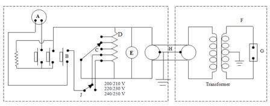

## Procedural Steps

1. Place the High Voltage transformer unit about 7 feet away from the control unit.

2. The control unit is connected to supply voltage taking care that the earth connections are effective.

3. The multiple point control switch is set at its lowest tapping.

4. The push button on control unit is pressed firmly for at least 5 seconds. Note that no breakdown occurs, in which case button should be released at once without delay. Breakdown is indicated by a continuous discharge across the gap, bubbling of oil in the cell and meter indicating a sudden voltage drop.

## Observation Table

| S.No. | Break Down Voltage |
|-------|--------------------|
| 1.    | .                  |
| 2.    | .                  |
| 3.    | .                  |
| n.    | .                  |

---

## Connection Diagram

### Fig 4.1: Portable oil testing set (50 kV)

**Components:**
- A - Socket for Supply loads
- B - Push
- C - Multiple Point Control
- D - Auto Transformer
- E - Voltmeter
- F - Step up Transformer
- G - Test Cell
- H - Inter Connecting Cable
- I - Supply Voltage Selector Switch
