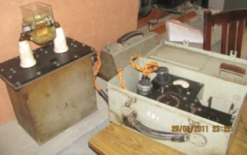
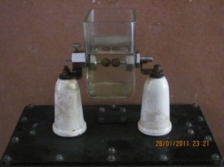
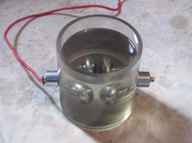
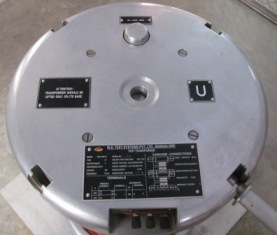
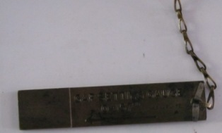

## Theory

The two unit portable testing set is designed for the periodical testing of samples of insulating oils drawn from plant on site and for checking the dielectric strength of new samples of oil.

The equipment is designed to operate from 200/250V, 50Hz, Single phase AC supply. Test gap voltage up to 50kV, it consists of two units, one is containing the testing transformer and other is control and metering equipment. These equipments are kept in a metal box to provide full protection to the apparatus during transport and storage.

The gap is adjusted between electrodes in accordance with British Standard Specification (BSS) no. 148.

 ##  Equipments Required

### Fig.1: Portable oil testing set

### Fig.2: HV transformer

### Fig.3: Gap setting gauge

<!-- end #menu -->

## Video for experiment:

   

    <b style="font-size:18px">Experiment 4. To measure the dielectric strength of transformer oil.</b>  
    <video width="480" height="360" controls>
        <source src=" videos/video4.mp4" type="video/mp4">
    </video>

